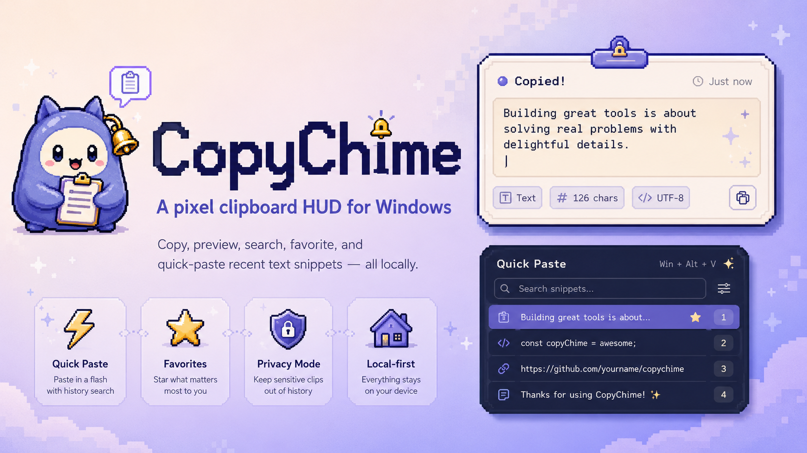

# CopyChime

<p align="center">
  
</p>

<p align="center">
  <strong>A tiny clipboard HUD for Windows</strong><br/>
  Copy, preview, and quickly reuse recent text snippets.
</p>

<p align="center">
  <a href="README.zh-CN.md">中文文档</a>
</p>

---

## What it is

CopyChime is a lightweight clipboard HUD that shows a notification when you copy text, lets you browse recent clipboard history, and quickly re-copy previous items.

## What it is not

CopyChime is **not** a full clipboard manager like Ditto, CopyQ, or EcoPaste. It intentionally stays simple:

- No image/file clipboard history
- No rich text support
- No cloud sync or accounts
- No AI or OCR
- No network requests
- No analytics or telemetry

## Download

Go to [GitHub Releases](https://github.com/watt-tang/CopyChime/releases) and download:

**CopyChime-0.1.0-win-portable.exe**

No installation required. Double-click to run.

## Features

- **Copy notification** — Shows a bubble with text preview, character count, and line count
- **Clipboard history** — Browse and re-copy recent text snippets
- **Pin items** — Keep important clips from being auto-cleared
- **Privacy mode** — Hide clipboard content from the UI
- **Sensitive content detection** — Automatically masks API keys, tokens, passwords
- **Ignore patterns** — Skip clipboard content matching custom rules
- **Theme support** — Light, Dark, Catppuccin, Mint, Mono, Pixel Lavender, System
- **System tray** — Minimize to tray, pause/resume, quick access
- **Global shortcuts** — Ctrl+Alt+C/H/P/M/V for quick control
- **Window position memory** — Remembers where you placed the HUD
- **Pixel mascot UI** — Cute pixel art mascot with sound feedback
- **Quick Paste Palette** — Ctrl+Alt+V to search and paste recent/favorite snippets
- **Favorites** — Save frequently used text snippets
- **Search** — Filter history and favorites
- **App Exclusion Rules** — Skip clipboard capture from password managers and other apps
- **Paste as Plain Text** — Strip zero-width chars and normalize text

## Tech Stack

| Layer | Technology |
|-------|-----------|
| Runtime | Electron 33 |
| UI | React 18 + TypeScript 5.6 |
| Bundler | Vite 6 |
| Packaging | electron-builder |
| CI/CD | GitHub Actions |
| Sound | Web Audio API (synthesized, no external files) |
| Theming | CSS Variables + `data-theme` attribute |
| Security | contextBridge + contextIsolation (nodeIntegration disabled) |
| Storage | JSON file in `app.getPath("userData")` |

## Privacy

CopyChime stores all data locally in your user data directory. It:

- Does **not** upload clipboard content anywhere
- Does **not** make any network requests
- Does **not** use analytics or telemetry
- Does **not** sync to cloud services

Sound feedback is generated locally using the Web Audio API. No audio files are loaded from the network.

## Windows SmartScreen Note

Current builds are **not code-signed**. Windows may show a SmartScreen warning when you first run the exe. This is normal for unsigned open-source software. Only download from the official [GitHub Releases](https://github.com/watt-tang/CopyChime/releases) page.

## Development

```bash
npm install
npm run dev
```

## Build

```bash
npm install
npm run typecheck
npm run build
```

## Package Windows Portable Exe

```bash
npm install
npm run dist:win
```

Output: `release/CopyChime-0.1.0-win-portable.exe`

## Release

To publish a new release:

```bash
git tag v0.1.0
git push origin v0.1.0
```

GitHub Actions will automatically build the Windows portable exe and upload it to a GitHub Release.

**Note:** Ensure your repo Settings → Actions → General → Workflow permissions is set to **Read and write permissions**.

## Global Shortcuts

| Shortcut | Action |
|----------|--------|
| Ctrl+Alt+C | Show/Hide window |
| Ctrl+Alt+H | Open history panel |
| Ctrl+Alt+P | Pause/Resume clipboard watching |
| Ctrl+Alt+M | Toggle privacy mode |
| Ctrl+Alt+V | Quick Paste Palette |

## Demo

TODO: Add GIF
